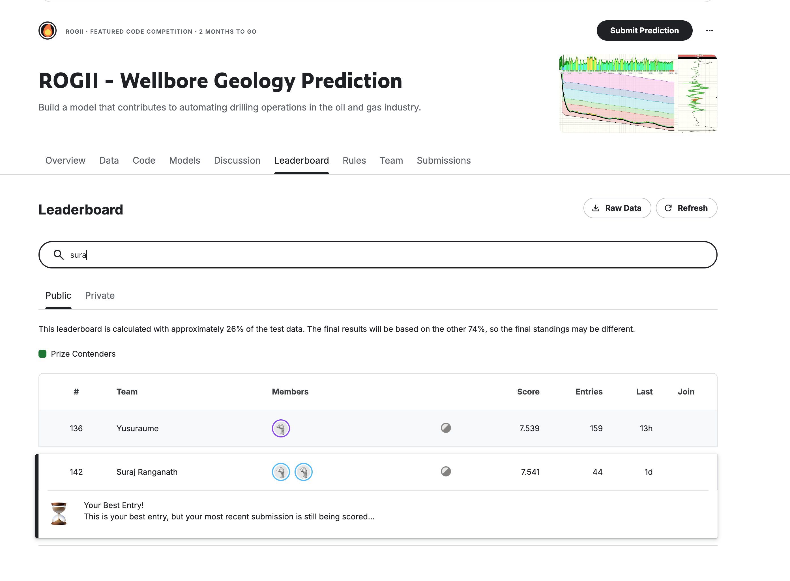

# Final Project Report

**Team:** Suraj Ranganath and Arunima Anand  
**Competition:** [ROGII - Wellbore Geology Prediction](https://www.kaggle.com/competitions/rogii-wellbore-geology-prediction/overview)  
**Code:** [GitHub repository](https://github.com/suraj-ranganath/rogii-wellbore-geology-lab)  
**Public Leaderboard Rank:** 142 out of 2,873 (Silver, as of June 12, 5:55PM)  

We worked on the ROGII Wellbore Geology Prediction competition, where the goal is to predict TVT values for unseen parts of wellbores. We started with simple baselines to understand the scale of the problem and to make sure the Kaggle notebook submission pipeline was correct. The last-known TVT baseline scored 15.883, which gave us a useful lower bar. From there, we tried several families of approaches: physical/PF selector models, Sunny/v10 artifact blends, target-free alignment, Ridge/PF hidden-safe blends, dynamic Z gates, structural Ridge-SP projection models, and pretrained geosteering-style models. A lot of the early work was not about chasing one public score; it was about learning which ideas were hidden-compatible, which ones failed because the hidden test set changed, and which local validation signals were actually trustworthy. For example, we learned that visible-overlap scoring was useful for checking row order and output sanity, but it was not reliable for choosing close model variants.

Following the professor's recommendation, we also looked carefully at public Kaggle discussions and open code, then reproduced the most promising ideas in our own controlled kernels instead of submitting them blindly. Suraj gave the main technical direction to focus on hidden-safe, domain-aware methods rather than static public-test tricks, and that turned out to be important. Static public-ID and test-leakage-style approaches failed or were not robust, while methods based on geosteering structure, stratigraphic projection, and blending independent signals improved consistently. We experimented locally with small runs, smoke tests, output validation, and local CV-style proxies before using Kaggle's limited daily submissions. We also used the GPU credits we had for heavier experiments and used GPT 5.5 XHigh on Codex to run short, Auto Research-style loops inspired by the professor's lecture: propose a small hypothesis, test or tune a few hyperparameters, inspect the result, and then decide whether the direction deserved a Kaggle submission. Across the project we made 50 Kaggle competition submissions by the time of this report, including successful runs, failed experiments, timeout cases, and today's five pending submissions. Arunima and Suraj also collaborated with coding agents to speed up implementation, experiment tracking, public-code review, and submission queueing, while still making the key modeling decisions based on validation results and domain reasoning.

Our best completed leaderboard result so far is a public RMSE of 7.541 from a runtime-safe SP45 projection plus fleongg pretrained geosteering blend with a guarded overlap override. The path to this model was gradual: the PF/physical family got us to about 8.78, Sunny/v10 improved to 8.421, hidden-safe Ridge reached 7.906, drift geosteering reached 7.858, and then the SP45/fleongg blend family became the strongest direction, improving to 7.551 and finally 7.541. The best model worked because it combined a strong structural SP45 projection signal with a pretrained geosteering signal, while staying safe for Kaggle's hidden reruns and runtime constraints. At the 5 PM reset today, we submitted five additional approaches that build on the same strongest family and related public code: two fleongg reruns, two new JAEMIN seed/affine variants, and a SP45/fleongg 0.65-weight improvement probe. Those submissions were still pending at the time of writing, so they may not finish before the project report deadline, but they represent our best final attempt to push the leaderboard score further.
